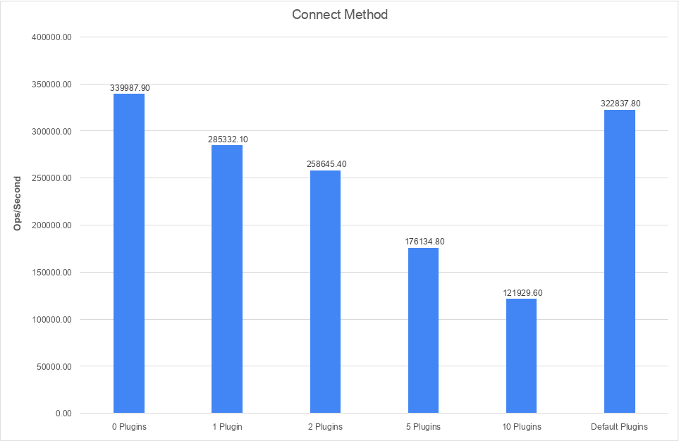
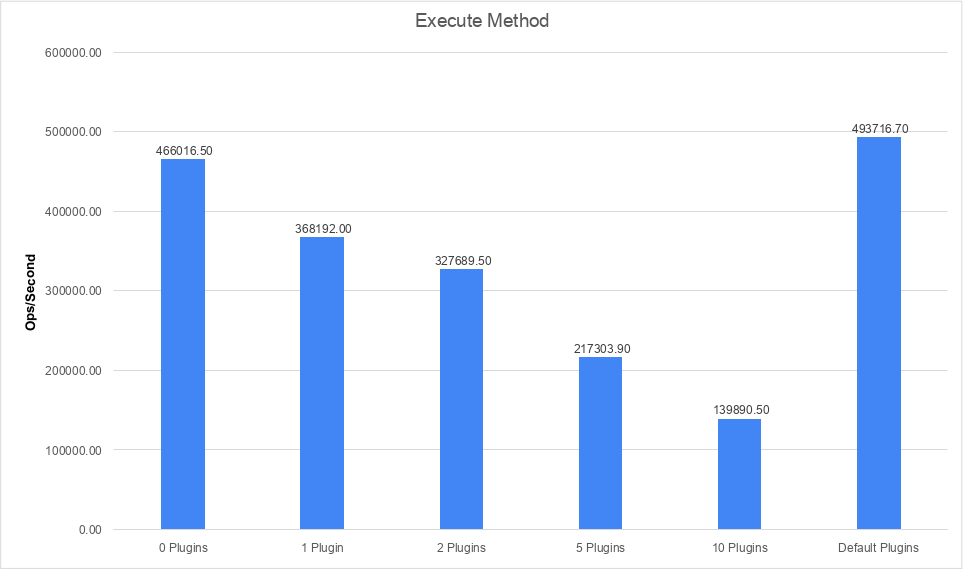
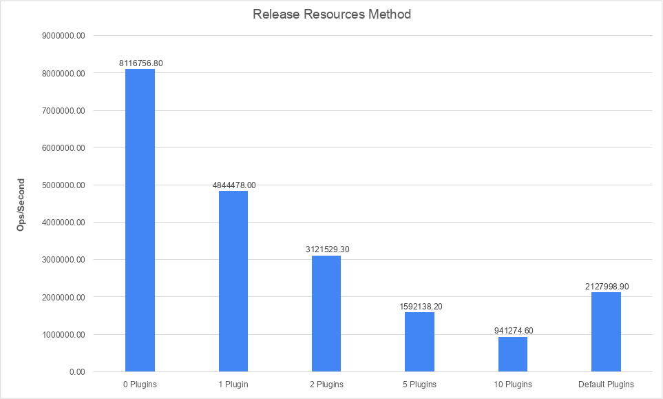
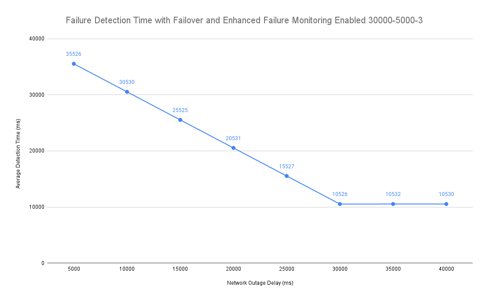
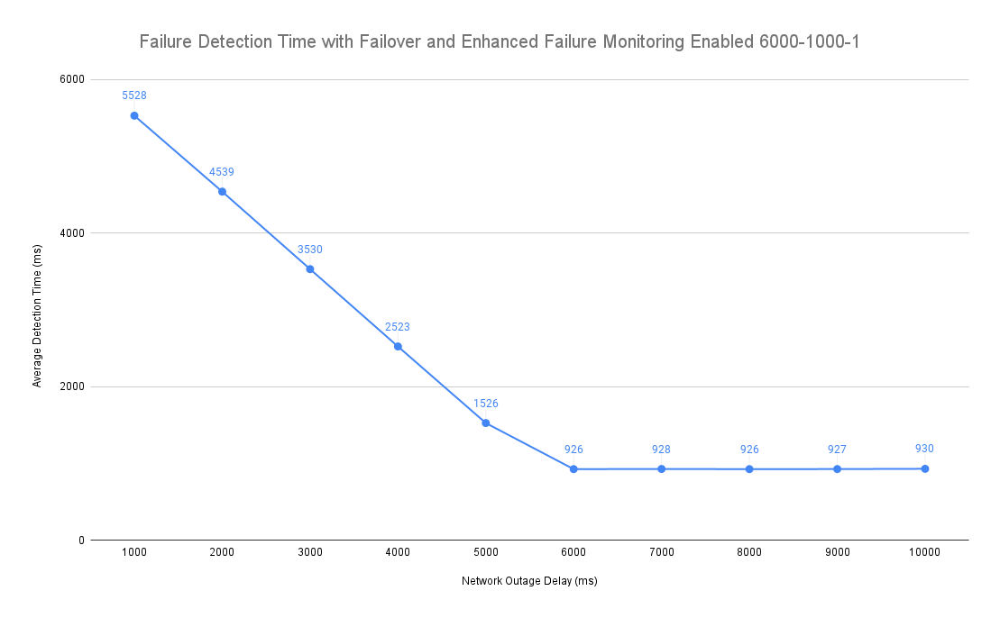
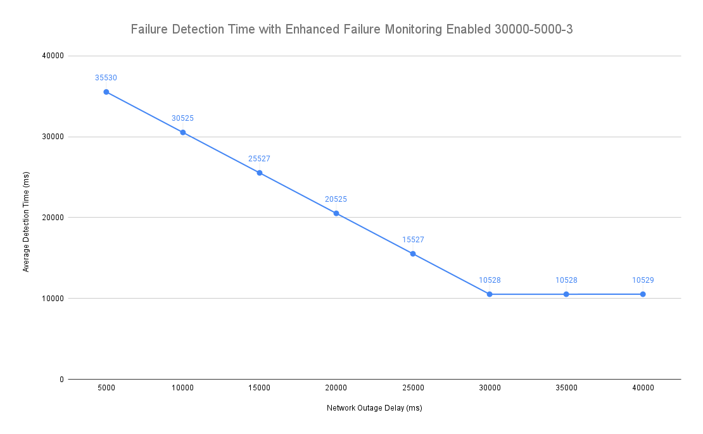
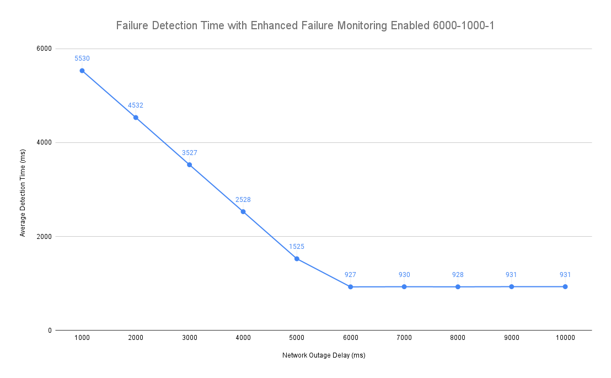

# Development Guide

### Prerequisites

- Ensure Node 21.0.0+ is installed
- (Optional) To run integration tests, an [AWS Account is required](IntegrationTests.md#aurora-test-requirements)

### Setup

Clone the AWS Advanced NodeJS Wrapper repository:

```bash
git clone https://github.com/aws/aws-advanced-nodejs-wrapper.git
```

You can now make changes in the repository.

### Setting Up the AWS Advanced NodeJS Wrapper

Navigate to project root:

```bash
cd aws-advanced-nodejs-wrapper
```

Install required packages:

```bash
npm install
```

## Testing Overview

The AWS Advanced NodeJS Wrapper uses the following tests to verify its correctness and performance:

| Tests                                         | Description                                                                                                           |
| --------------------------------------------- | --------------------------------------------------------------------------------------------------------------------- |
| Unit tests                                    | Tests for AWS Advanced NodeJS Wrapper correctness.                                                                    |
| Failover integration tests                    | Wrapper-specific tests for different reader and writer failover workflows using the Failover Connection Plugin.       |
| Enhanced failure monitoring integration tests | Wrapper-specific tests for the enhanced failure monitoring functionality using the Host Monitoring Connection Plugin. |
| Read Write Splitting integration tests        | Wrapper-specific tests for the read write splitting functionality using the Read Write Splitting Plugin.              |
| AWS authentication integration tests          | Wrapper-specific tests for AWS authentication methods with the AWS IAM Authentication Plugin.                         |
| Connection plugin manager benchmarks          | The benchmarks measure the overhead from executing method calls with multiple connection plugins enabled.             |

### Performance Tests

The AWS Advanced NodeJS Wrapper has 2 types of performance tests:

1. manually-triggered performance tests measuring the failover and enhanced failure monitoring plugins' performance under different configurations.
2. benchmarks measuring the AWS Advanced NodeJS Wrapper's overhead when executing simple methods using the [benny benchmarking framework](https://www.npmjs.com/package/benny).

#### AWS Advanced NodeJS Wrapper Benchmarks

There are specific benchmarks measuring the AWS Advanced NodeJS Wrapper's [pipelines](Pipelines.md). The goal of these benchmarks is to measure the overhead of using the AWS Advanced NodeJS Wrapper with multiple plugins enabled. These benchmarks do not make actual connections to the databases, and they test connections with different numbers of simple test plugins and with the default plugin combination which consists of the [aurora connection tracker](../using-the-nodejs-wrapper/using-plugins/UsingTheAuroraConnectionTrackerPlugin.md), [failover](../using-the-nodejs-wrapper/using-plugins/UsingTheFailoverPlugin.md), and [host monitoring](../using-the-nodejs-wrapper/using-plugins/UsingTheHostMonitoringPlugin.md). The images below represent the benchmarks for the `connect`, `execute` and `releaseResources` pipelines.

##### [Connect Pipeline](Pipelines.md#connect-pipeline)



##### [Execute Pipeline](Pipelines.md#execute-pipeline)



##### [Release Resources Pipeline](Pipelines.md#release-resources-pipeline)



See [here](PluginPipelinePerformanceResults.md#benchmarks) for a more detailed performance breakdown.

#### Failover-specific Performance Tests

The diagrams in this section show the AWS Advanced NodeJS Wrapper's failure detection performance with or without the Failover Connection Plugin under different settings.
The performance tests share the following workflow:

1. The AWS Advanced NodeJS Wrapper executes an SQL query with a long execution time.
2. After a network outage delay in milliseconds, the test triggers a network outage.
   Varying values for the network outage delay are tested, represented on the X axis of the diagrams below.
3. Measures elapsed time between when the network outage and
   - when the AWS Advanced NodeJS Wrapper detects the network failure if the Host Monitoring Plugin is used, or
   - when the AWS Advanced NodeJS Wrapper finishes the failover process if the Failover Plugin is used.

The following diagrams show how the AWS Advanced NodeJS Wrapper performs under a more common failure detection setting versus a more aggressive setting.

Common Failure Detection Setting

| Parameter                  | Value    |
| -------------------------- | -------- |
| `failoverTimeoutMs`        | `120000` |
| `failureDetectionTime`     | `30000`  |
| `failureDetectionInterval` | `5000`   |
| `failureDetectionCount`    | `3`      |

Aggressive Failure Detection Setting

| Parameter                  | Value    |
| -------------------------- | -------- |
| `failoverTimeoutMs`        | `120000` |
| `failureDetectionTime`     | `6000`   |
| `failureDetectionInterval` | `1000`   |
| `failureDetectionCount`    | `1`      |

For more details on failure detection settings, see [here](../using-the-nodejs-wrapper/using-plugins/UsingTheHostMonitoringPlugin.md#enhanced-failure-monitoring-parameters).
For more details on failover settings, see [here](../using-the-nodejs-wrapper/FailoverConfigurationGuide.md).

The two images below show the average failure detection time when failover and enhanced failure monitoring is enabled.

This graph uses a 30000 millisecond `FailureDetectionGraceTime` and 5000 millisecond `NetworkOutageDelayMillis`:


This graph uses a 6000 millisecond `FailureDetectionGraceTime` and 1000 millisecond `NetworkOutageDelayMillis`:

See [here](PluginPipelinePerformanceResults.md#failover-performance-with-different-enhanced-failure-monitoring-configuration) for more details.

The two images below show the average failure detection time when enhanced failure monitoring is enabled.

This graph uses a 30000 millisecond `FailureDetectionGraceTime` and 5000 millisecond `NetworkOutageDelayMillis`:


This graph uses a 6000 millisecond `FailureDetectionGraceTime` and 1000 millisecond `NetworkOutageDelayMillis`:

See [here](PluginPipelinePerformanceResults.md#enhanced-failure-monitoring-performance-with-different-failure-detection-configuration) for more details.

#### Read-Write Splitting and Internal Connection Pooling Performance Tests

The diagram in this section shows the AWS Advanced NodeJS Wrapper's performance when using the read-write splitting plugin, with or without connection pooling enabled. This test sets up a large number of connections in parallel; the initial connection is to the writer but will be changed to a random reader instance. The test executes a long query many times to simulate heavy queries.

The average overhead time is measured as the average time difference between running the entire test with the read-write plugin and running the entire test without any plugins. The baseline overhead time is 0 because there are no plugins in this scenario and thus there is no plugin overhead.

Note that the given overhead values represent the total overhead of running the entire test workflow rather than the overhead of executing a single method. The test executes 1 writer query and 1 read-only query from 10 connections simultaneously.


See [here]() for a more detailed performance breakdown.

### Running the Tests

After building the AWS Advanced NodeJS Wrapper you can now run the unit tests.
This will also validate your environment is set up correctly.

```bash
npm test
```

#### Integration Tests

For more information on how to run the integration tests, please visit [Integration Tests](/docs/development-guide/IntegrationTests.md).

#### Sample Code

[Postgres Connection Test Sample Code](./../../examples/aws_driver_example/aws_simple_connection_postgresql_example.ts)<br>
[MySQL Connection Test Sample Code](./../../examples/aws_driver_example/aws_simple_connection_mysql_example.ts)

## Architecture

For more information on how the AWS Advanced NodeJS Wrapper functions and how it is structured, please visit [Architecture](./Architecture.md).
