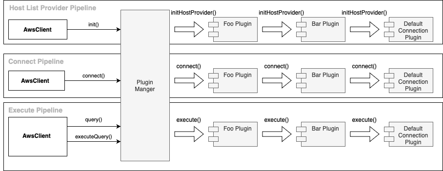

# Plugin Manager

The plugin manager has the following main functionalities:

- Load and initialize plugins
- Initiate [pipelines](./Pipelines.md)

## Load and Initialize Plugins

The plugin manager initializes all plugins with codes given to the [`plugins`](../using-the-nodejs-wrapper/UsingTheNodejsWrapper.md#connection-plugin-manager-parameters) connection parameter.

### Clean Up Resources

The Aurora Connection Tracker Plugin, Host Monitoring Connection Plugin, and Read/Write Splitting Plugin can have shared resources. The plugin manager handles cleaning up resources that may be shared between connections at the end of an application through the `releaseResources` method.

## Initiate Pipelines

During the initial connection phase, where the plugin manager gets initialized, it initiates the host list provider and the connect pipelines. These two pipelines will set up a host list provider to be used by all the plugins and the initial connection.

All subsequent methods calls will trigger the execute pipeline.

> [!NOTE]  
> The execute pipeline does not limit to `execute` methods such as `query()` or `executeQuery()`. All methods, such as `getCatalog()` can trigger the execute pipeline. In other words, the execute pipeline is to execute all kinds of methods.
