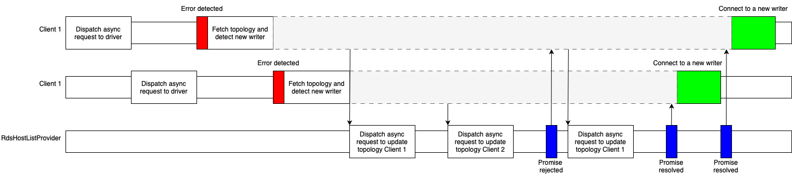
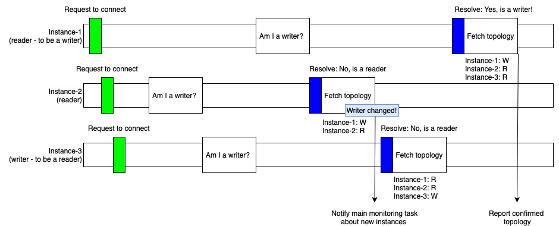

# Failover Plugin v2

The AWS Advanced NodeJS Wrapper uses the Failover Plugin v2 to provide minimal downtime in the event of a DB instance failure. The plugin is the next version (v2) of the [Failover Plugin](./UsingTheFailoverPlugin.md) and unless explicitly stated otherwise, most of the information and suggestions for the Failover Plugin are applicable to the Failover Plugin v2.

## Differences between the Failover Plugin and the Failover Plugin v2

The Failover Plugin performs a failover process for each DB connection. Each failover process is triggered independently and is unrelated to failover processes in other connections. While such independence between failover processes has some benefits, it also leads to additional resources like extra asynchronous tasks. If dozens of DB connections are failing over at the same time, it may cause significant load on a client environment.

<i>Picture 1. Each connection triggers its own failover process to detect a new writer.</i>
  

If a connection needs to get the latest topology, it calls `RdsHostListProvider`. As shown in _Picture 1_ above, different connections start and end their failover processes independently.

The Failover Plugin v2 uses an optimized approach where the process of detecting and confirming a cluster topology is delegated to a central topology monitoring component that runs a separate asynchronous monitoring task. When the topology is confirmed and a new writer is detected, each waiting connection can resume and reconnect to a required host. This design helps minimize resources required for failover processing and scales better compared to the Failover Plugin.

<i>Picture 2. Connections call MonitoringRdsHostListProvider, which is responsible for detecting the new writer.</i>
  

If two connections encounter communication issues with their internal (physical) DB connections, each connection may send a request to the topology monitoring component (`MonitoringRdsHostListProvider` in _Picture 2_) for updated topology information reflecting the new writer. Both connections are notified as soon as the latest topology is available. Connection tasks can resume, continue with their suspended workflows, and reconnect to a reader or a writer host as needed.

The topology monitoring component mentioned above (`MonitoringRdsHostListProvider`) fetches and confirms topology periodically. Outside of failover it performs "slow rate monitoring" at intervals set by `clusterTopologyRefreshRateMs`. This ensures use of the most up to date topology. When failover is triggered, it enters "panic mode" and works to detect a writer. After a new writer has been detected, the `MonitoringRdsHostListProvider` enters "high rate monitoring", with intervals set by `clusterTopologyHighRefreshRateMs`. This allows time for all readers to appear in the topology. The default of 30 seconds is usually enough time for cluster failover to complete and cluster topology to stabilize.

Usually it uses a connection to a writer host to fetch a cluster topology. Using a connection to a writer host allows to get topology first hand without a risk of getting stale data as in case of fetching it from a reader. In some exceptional cases the monitoring component may temporarily use a reader connection to fetch a topology however it will switch back to a writer host as soon as possible.

<i>Picture 3. MonitoringRdsHostListProvider detects a new writer by monitoring each host in a separate task.</i> 
  

When the cluster topology needs to be confirmed, the monitoring component opens new monitoring tasks, one for each host in the cluster. Each of these tasks tries to connect to a host and checks if the host is a writer. When Aurora failover occurs, the new writer host is the first host to reflect the true topology of the cluster. Other hosts connect to the new writer shortly after and update their local copies of the topology. Topology information acquired from a reader host may be outdated/inaccurate for a short period after failover. You can see a typical example of stale topology in _Picture 3_ above with `Instance-3`. The stale topology incorrectly shows that `Instance-3` is still a writer.

The asynchronous tasks monitoring the topology stop when a new writer is detected. Using the default setting of `clusterTopologyHighRefreshRateMs`, for 30 seconds after a new writer is detected and after all waiting connections have been notified, topology continues to be updated at an increased rate. This allows time for cluster failover to complete and cluster topology to stabilize.

All improvements mentioned above help the Failover Plugin v2 to operate with improved performance and less demand for resources.

A summary of the key differences and between the `failover` and `failover2` plugins is outlined below.

With the `failover` plugin:

- Each connection performs its own failover process.
- Each connection fetches topology by calling the `RdsHostListProvider`.
- Topology may be fetched from a reader host and it may be stale.

With the `failover2` plugin:

- Each client delegates detection of the new writer to the `MonitoringRdsHostListProvider` and suspends until the new writer is confirmed.
- The `MonitoringRdsHostListProvider` tries to connect to every cluster host.
- The `MonitoringRdsHostListProvider` uses an "Am I a writer?" approach to avoid reliance on stale topology.
- The `MonitoringRdsHostListProvider` continues topology monitoring at an increased rate to ensure all cluster hosts appear in the topology.

## Using the Failover Plugin v2

The Failover Plugin v2 will **NOT** be enabled by default. It must be explicitly included by adding the plugin code `failover2` to the [`plugins`](../UsingTheNodejsWrapper.md#plugins) parameter, or by adding it to the current [Configuration Profile](../UsingTheNodejsWrapper.md#configuration-profiles). After you load the plugin, the failover2 feature will be enabled.

Please refer to the [failover configuration guide](../FailoverConfigurationGuide.md) for tips to keep in mind when using the failover plugin.

> [!WARNING]
> Do not use the `failover` and `failover2` plugins at the same time for the same connection!

### Failover Plugin v2 Configuration Parameters

In addition to the parameters that you can configure for the underlying driver, you can pass the following parameters to the AWS Advanced NodeJS Wrapper through the connection URL to specify additional failover behavior.

| Parameter                            |  Value  | Required | Description                                                                                                                                                                                                                                                                                                                                                                                                                                                                                                                                                                                                                                                                                                                                                                                                                                                | Default Value                                                                                                                                    |
| ------------------------------------ | :-----: | :------: | :--------------------------------------------------------------------------------------------------------------------------------------------------------------------------------------------------------------------------------------------------------------------------------------------------------------------------------------------------------------------------------------------------------------------------------------------------------------------------------------------------------------------------------------------------------------------------------------------------------------------------------------------------------------------------------------------------------------------------------------------------------------------------------------------------------------------------------------------------------- | ------------------------------------------------------------------------------------------------------------------------------------------------ |
| `failoverMode`                       | String  |    No    | Defines a mode for failover process. Failover process may prioritize nodes with different roles and connect to them. Possible values:   - `strict-writer` - Failover process follows writer instance and connects to a new writer when it changes. - `reader-or-writer` - During failover, the wrapper tries to connect to any available/accessible reader instance. If no reader is available, the wrapper will connect to a writer instance. This logic mimics the logic of the Aurora read-only cluster endpoint. - `strict-reader` - During failover, the wrapper tries to connect to any available reader instance. If no reader is available, the wrapper raises an error. Reader failover to a writer instance will only be allowed for single-instance clusters. This logic mimics the logic of the Aurora read-only cluster endpoint. | Default value depends on connection url. For Aurora read-only cluster endpoint, it's set to `reader-or-writer`. Otherwise, it's `strict-writer`. |
| `enableClusterAwareFailover`         | Boolean |    No    | Set to `true` to enable the fast failover behavior offered by the AWS Advanced NodeJS Wrapper. Set to `false` for simple connections that do not require fast failover functionality.                                                                                                                                                                                                                                                                                                                                                                                                                                                                                                                                                                                                                                                                      | `true`                                                                                                                                           |
| `clusterTopologyRefreshRateMs`       | Number  |    No    | Cluster topology refresh rate in milliseconds when a cluster is not in failover. It refers to the regular, slow monitoring rate explained above.                                                                                                                                                                                                                                                                                                                                                                                                                                                                                                                                                                                                                                                                                                           | `30000`                                                                                                                                          |
| `clusterTopologyHighRefreshRateMs`   | Number  |    No    | Interval of time in milliseconds to wait between attempts to update cluster topology after the writer has come back online following a failover event. It corresponds to the increased monitoring rate described earlier. Usually, the topology monitoring component uses this increased monitoring rate for 30s after a new writer was detected.                                                                                                                                                                                                                                                                                                                                                                                                                                                                                                          | `100`                                                                                                                                            |
| `failoverTimeoutMs`                  | Number  |    No    | Maximum allowed time in milliseconds to attempt reconnecting to a new writer or reader instance after a cluster failover is initiated.                                                                                                                                                                                                                                                                                                                                                                                                                                                                                                                                                                                                                                                                                                                     | `300000`                                                                                                                                         |
| `failoverReaderHostSelectorStrategy` | String  |    No    | The strategy that should be used to select a new reader host while opening a new connection. See: [Reader Selection Strategies](./../ReaderSelectionStrategies.md) for options.                                                                                                                                                                                                                                                                                                                                                                                                                                                                                                                                                                                                                                                                            | `random`                                                                                                                                         |

Please refer to the original [Failover Plugin](./UsingTheFailoverPlugin.md) for more details about error codes, configurations, connection pooling and sample codes.

If you would like to use different parameters for the topology monitoring connections, these can be added with the prefix `topology_monitoring_`. For example, if you wanted to connect with a different user, you could pass in the parameter `user: "admin"` and `topology_monitoring_user: "other_user"`. Within the main program connections will connect with the `admin` user and ignore `other_user`. When monitoring the topology `other_user` will be used to connect, replacing `admin`.

### Sample Code

[PostgreSQL Failover Sample Code](../../../examples/aws_driver_example/aws_failover_postgresql_example.ts) 
[MySQL Failover Sample Code](../../../examples/aws_driver_example/aws_failover_mysql_example.ts)

This sample code uses the original `failover` plugin, but it can also be used with the `failover2` plugin. Configuration parameters should be adjusted in accordance with the table above.
