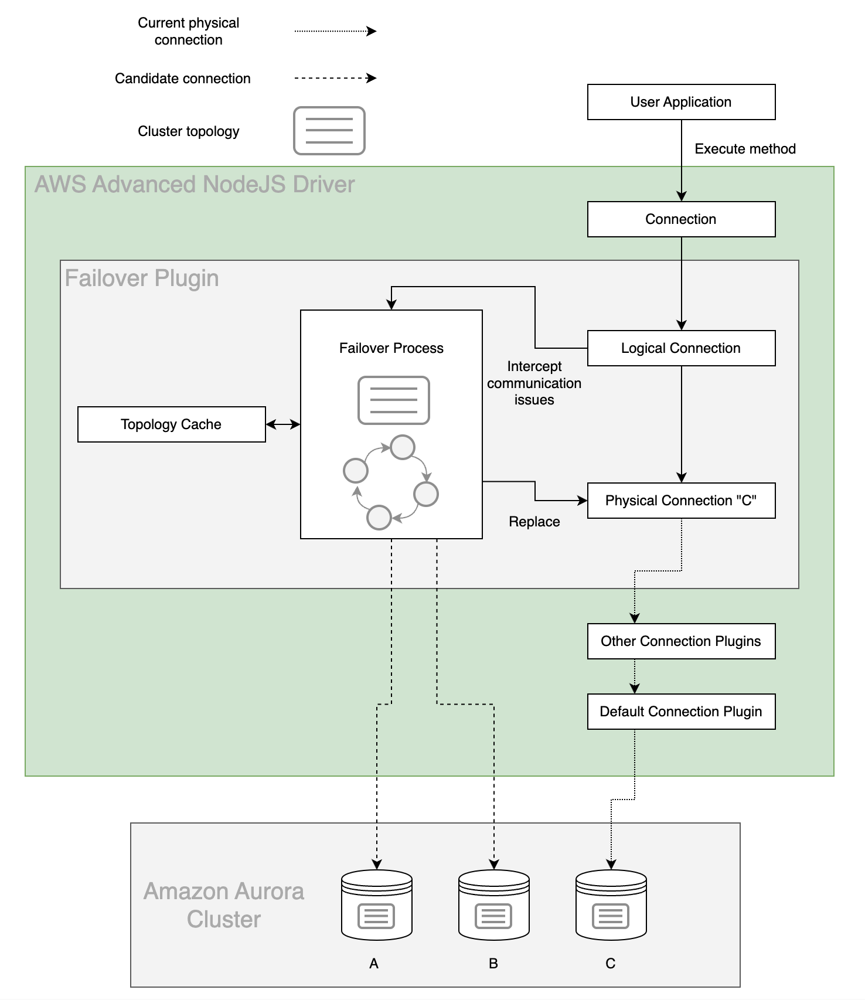

# Failover Plugin

In an Amazon Aurora database (DB) cluster, failover is a mechanism by which Aurora automatically repairs the DB cluster status when a primary DB instance becomes unavailable. It achieves this goal by electing an Aurora Replica to become the new primary DB instance, so that the DB cluster can provide maximum availability to a primary read-write DB instance. The AWS Advanced NodeJS Wrapper uses the Failover Plugin to coordinate with this behavior in order to provide minimal downtime in the event of a DB instance failure.

## The AWS Advanced NodeJS Wrapper Failover Process

The figure above provides a simplified overview of how the AWS Advanced NodeJS Wrapper handles an Aurora failover encounter. Starting at the top of the diagram, an application uses the NodeJS Wrapper to get a logical connection to an Aurora database.

In this example, the application requests a connection using the Aurora DB cluster endpoint and is returned with a logical connection that is physically connected to the primary DB instance in the DB cluster, DB instance C. By design, details about which specific DB instance the physical connection is connected to have been abstracted away.

Over the course of the application's lifetime, it executes various statements against the logical connection. If DB instance C is stable and active, these statements succeed and the application continues as normal. If DB instance C experiences a failure, Aurora will initiate failover to promote a new primary DB instance. At the same time, the NodeJS Wrapper will intercept the related communication error and kick off its own internal failover process.

If the primary DB instance has failed, the NodeJS Wrapper attempts to use its internal topology cache to temporarily connect to an active Aurora Replica. This Aurora Replica will be periodically queried for the DB cluster topology until the new primary DB instance is identified (DB instance A or B in this case). If the wrapper is unable to connect to an active Aurora Replica or the cluster is still being reconfigured, the wrapper will retry the connection until it is successful.

At this point, the NodeJS Wrapper will connect to the new primary DB instance and return control to the application by raising a FailoverSuccessError, so you can reconfigure the session state as needed. Although the DNS endpoint for the DB cluster might not yet resolve the new primary DB instance, the NodeJS Wrapper has already discovered this new DB instance during its failover process, and will be directly connected to it when the application continues executing statements. In this way the NodeJS Wrapper provides a faster way to reconnect to a newly promoted DB instance, thus increasing the availability of the DB cluster.

## Using the Failover Plugin

The failover plugin will be enabled by default if the [`plugins`](../UsingTheNodejsWrapper.md#plugins) value is not specified. The failover plugin can also be explicitly included by adding the plugin code `failover` to the [`plugins`](../UsingTheNodejsWrapper.md#plugins) value. After you load the plugin, the failover feature will be enabled by default and the `enableClusterAwareFailover` parameter will be set to true.     Please refer to the [failover configuration guide](../FailoverConfigurationGuide.md) for tips to keep in mind when using the failover plugin.

### Failover Parameters

In addition to the parameters that you can configure for the underlying driver, you can pass the following parameters to the AWS Advanced NodeJS Wrapper through the connection URL to specify additional failover behavior.

| Parameter                              |  Value  | Required | Description                                                                                                                                                                                                                                                                                                                                                                                                                                                                                                                                                                                                                                                                                                                                                                                                                                                                                                                                                                                                                                      | Default Value                                                                                                                                    |
| -------------------------------------- | :-----: | :------: | :----------------------------------------------------------------------------------------------------------------------------------------------------------------------------------------------------------------------------------------------------------------------------------------------------------------------------------------------------------------------------------------------------------------------------------------------------------------------------------------------------------------------------------------------------------------------------------------------------------------------------------------------------------------------------------------------------------------------------------------------------------------------------------------------------------------------------------------------------------------------------------------------------------------------------------------------------------------------------------------------------------------------------------------------- | ------------------------------------------------------------------------------------------------------------------------------------------------ |
| `failoverMode`                         | String  |    No    | Defines a mode for failover process. Failover process may prioritize nodes with different roles and connect to them. Possible values:   - `strict-writer` - Failover process follows writer instance and connects to a new writer when it changes. - `reader-or-writer` - During failover, the wrapper tries to connect to any available/accessible reader instance. If no reader is available, the wrapper will connect to a writer instance. This logic mimics the logic of the Aurora read-only cluster endpoint. - `strict-reader` - During failover, the wrapper tries to connect to any available reader instance. If no reader is available, the wrapper raises an error. Reader failover to a writer instance will only be allowed for single-instance clusters. This logic mimics the logic of the Aurora read-only cluster endpoint.  If this parameter is omitted, default value depends on connection url. For Aurora read-only cluster endpoint, it's set to `reader-or-writer`. Otherwise, it's `strict-writer`. | Default value depends on connection url. For Aurora read-only cluster endpoint, it's set to `reader-or-writer`. Otherwise, it's `strict-writer`. |
| `enableClusterAwareFailover`           | Boolean |    No    | Set to `true` to enable the fast failover behavior offered by the AWS Advanced NodeJS Wrapper. Set to `false` for simple connections that do not require fast failover functionality.                                                                                                                                                                                                                                                                                                                                                                                                                                                                                                                                                                                                                                                                                                                                                                                                                                                            | `true`                                                                                                                                           |
| `failoverClusterTopologyRefreshRateMs` | Number  |    No    | Cluster topology refresh rate in milliseconds during a writer failover process. During the writer failover process, cluster topology may be refreshed at a faster pace than normal to speed up discovery of the newly promoted writer.                                                                                                                                                                                                                                                                                                                                                                                                                                                                                                                                                                                                                                                                                                                                                                                                           | `2000`                                                                                                                                           |
| `failoverReaderConnectTimeoutMs`       | Number  |    No    | Maximum allowed time in milliseconds to attempt to connect to a reader instance during a reader failover process.                                                                                                                                                                                                                                                                                                                                                                                                                                                                                                                                                                                                                                                                                                                                                                                                                                                                                                                                | `30000`                                                                                                                                          |
| `failoverTimeoutMs`                    | Number  |    No    | Maximum allowed time in milliseconds to attempt reconnecting to a new writer or reader instance after a cluster failover is initiated.                                                                                                                                                                                                                                                                                                                                                                                                                                                                                                                                                                                                                                                                                                                                                                                                                                                                                                           | `300000`                                                                                                                                         |
| `failoverWriterReconnectIntervalMs`    | Number  |    No    | Interval of time in milliseconds to wait between attempts to reconnect to a failed writer during a writer failover process.                                                                                                                                                                                                                                                                                                                                                                                                                                                                                                                                                                                                                                                                                                                                                                                                                                                                                                                      | `2000`                                                                                                                                           |

## Failover Errors

| Errors                            | Is the connection valid? | Can the connection be reused? | Has the session state changed? | Does the session need to be reconfigured? | Does the last statement need to be re-executed? | Does the transaction need to be restarted? |
| --------------------------------- | ------------------------ | ----------------------------- | ------------------------------ | ----------------------------------------- | ----------------------------------------------- | ------------------------------------------ |
| FailoverFailedError               | No                       | No                            | N/A                            | N/A                                       | Yes                                             | Yes                                        |
| FailoverSuccessError              | Yes                      | Yes                           | Yes                            | Yes                                       | Yes                                             | N/A                                        |
| TransactionResolutionUnknownError | Yes                      | Yes                           | Yes                            | Yes                                       | Yes                                             | Yes                                        |

### FailoverFailedError

When the AWS Advanced NodeJS Wrapper throws a `FailoverFailedError`, the original connection has failed, and the AWS Advanced NodeJS Wrapper tried to failover to a new instance, but was unable to. There are various reasons this may happen: no nodes were available, a network failure occurred, and so on. In this scenario, please wait until the server is up or other problems are solved. (Error will be thrown.)

### FailoverSuccessError

When the AWS Advanced NodeJS Wrapper throws a `FailoverSuccessError`, the original connection has failed while outside a transaction, and the AWS Advanced NodeJS Wrapper successfully failed over to another available instance in the cluster. However, any session state configuration of the initial connection is now lost. In this scenario, you should:

- Reuse and reconfigure the original connection (e.g., reconfigure session state to be the same as the original connection).

- Repeat that query that was executed when the connection failed, and continue work as desired.

### TransactionResolutionUnknownError

When the AWS Advanced NodeJS Wrapper throws a `TransactionResolutionUnknownError`, the original connection has failed within a transaction. In this scenario, the NodeJS Wrapper first attempts to rollback the transaction and then fails over to another available instance in the cluster. Note that the rollback might be unsuccessful as the initial connection may be broken at the time that the NodeJS Wrapper recognizes the problem. Note also that any session state configuration of the initial connection is now lost. In this scenario, you should:

- Reuse and reconfigure the original connection (e.g: reconfigure session state to be the same as the original connection).

- Restart the transaction and repeat all queries which were executed during the transaction before the connection failed.

- Repeat that query which was executed when the connection failed and continue work as desired.

#### Sample Code

[PostgreSQL Failover Sample Code](../../../examples/aws_driver_example/aws_failover_postgresql_example.ts) 
[MySQL Failover Sample Code](../../../examples/aws_driver_example/aws_failover_mysql_example.ts)

> [!WARNING]
>
> #### Warnings About Proper Usage of the AWS Advanced NodeJS Wrapper
>
> 1.  Some users may wrap invocations against a Client object in a try-catch block or add a `.catch()` block to the invocation, and dispose of the Client object if an Error occurs. In this case, the application will lose the fast-failover functionality offered by the NodeJS Wrapper. When failover occurs, the NodeJS Wrapper internally establishes a ready-to-use connection inside the original Client object before throwing an Error to the user. If this Client object is disposed of, the newly established connection will be thrown away. The correct practice is to check the error type of the Error and reuse the Client object if the error code indicates successful failover. The [PostgreSQL Failover Sample Code](./../../../examples/aws_driver_example/aws_failover_postgresql_example.ts) and [MySQL Failover Sample Code](./../../../examples/aws_driver_example/aws_failover_mysql_example.ts) demonstrates this practice. See the section about [Failover Errors](#failover-errors) for more details.
> 2.  We highly recommended that you use the cluster and read-only cluster endpoints instead of the direct instance endpoints of your Aurora cluster, unless you are confident in your application's use of instance endpoints. Although the NodeJS Wrapper will correctly failover to the new writer instance when using instance endpoints, use of these endpoints is discouraged because individual instances can spontaneously change reader/writer status when failover occurs. The NodeJS Wrapper will always connect directly to the instance specified if an instance endpoint is provided, so a write-safe connection cannot be assumed if the application uses instance endpoints.

### Blue/Green Deployments

Although the AWS Advanced NodeJS Wrapper is not compatible with [AWS Blue/Green Deployments](https://docs.aws.amazon.com/whitepapers/latest/overview-deployment-options/bluegreen-deployments.html) and doesn't officially support them, the Failover Plugin has been validated for clusters with Blue/Green Deployments. While general basic connectivity to `Blue` and `Green` clusters
is always in place, some failover cases are not fully supported. The team is aware of these cases and working on them to bring
AWS Blue/Green Deployment support at full scale. Meanwhile, users may consider using the configuration parameter [`enableGreenHostReplacement`](../UsingTheNodejsWrapper.md#aws-advanced-nodejs-wrapper-parameters), which allows the wrapper to replace `Green` DNS endpoints when they become unavailable after Blue/Green switchover is completed.
