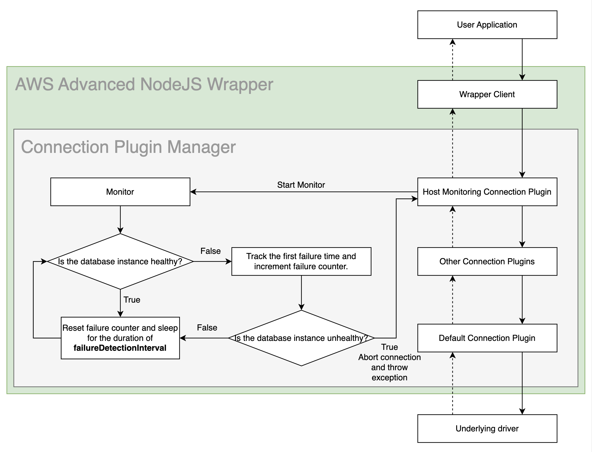
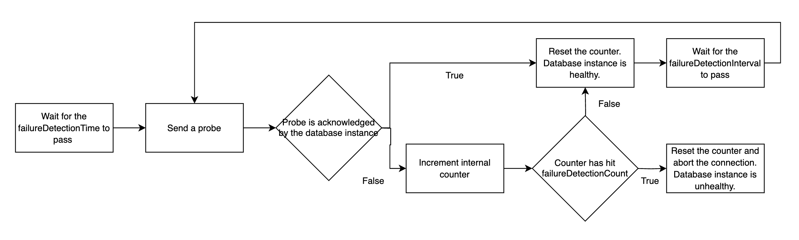

# Host Monitoring Plugin

## Enhanced Failure Monitoring

The figure that follows shows a simplified Enhanced Failure Monitoring (EFM) workflow. Enhanced Failure Monitoring is a feature available from the Host Monitoring Connection Plugin. The Host Monitoring Connection Plugin periodically checks the connected database instance's health or availability. If a database instance is determined to be unhealthy, the connection will be aborted. The Host Monitoring Connection Plugin uses the [Enhanced Failure Monitoring Parameters](#enhanced-failure-monitoring-parameters) and a database host's responsiveness to determine whether an instance is healthy.

<div style="text-align:center"></div>

### The Benefits of Enhanced Failure Monitoring

Enhanced Failure Monitoring helps user applications detect failures earlier. When a user application executes a query, EFM may detect that the connected database instance is unavailable. When this happens, the query is cancelled and the connection will be aborted. This allows queries to fail fast instead of waiting indefinitely or failing due to a timeout.

One use case is to pair EFM with the [Failover Connection Plugin](./UsingTheFailoverPlugin.md). When EFM discovers a database instance failure, the connection will be aborted. Without the Failover Connection Plugin, the connection would be terminated up to the user application level. With the Failover Connection Plugin, the wrapper can attempt to failover to a different, healthy database instance where the query can be executed.

Not all applications will have a need for Enhanced Failure Monitoring. If an application's query times are predictable and short, and the application does not execute any long-running SQL queries, Enhanced Failure Monitoring may not be necessary.

### Enabling the Host Monitoring Connection Plugin

Enhanced Failure Monitoring will be enabled by default if the [`plugins`](../UsingTheNodejsWrapper.md#connection-plugin-manager-parameters) value is not specified. The Host Monitoring Connection Plugin can also be explicitly included by adding the plugin code `efm` to the [`plugins`](../UsingTheNodejsWrapper.md#aws-advanced-nodejs-wrapper-parameters) value, or by adding it to the current [driver profile](../UsingTheNodejsWrapper.md#aws-advanced-nodejs-wrapper-parameters). Enhanced Failure Monitoring is enabled by default when the Host Monitoring Connection Plugin is loaded, but it can be disabled with the parameter `failureDetectionEnabled` set to `false` or by explicitly removing `efm` from the list of plugins.

> [!NOTE]
> When loading the Host Monitoring Connection Plugin, the order plugins are loaded in matters. Plugins are automatically ordered, but if that is disabled, we recommend that you load the Host Monitoring Connection Plugin at the end (or as close to the end) as possible. When used in conjunction with the Failover Connection Plugin, the Host Monitoring Connection Plugin must be loaded after the Failover Connection Plugin. For example, when loading plugins with the `plugins` parameter, the parameter value should be `failover,...,efm`.

### Enhanced Failure Monitoring Parameters

<div style="text-align:center"></div>

Each connection has its own set of parameters. The `failureDetectionTime` is how long the monitor waits after a SQL query is started to send a probe to a database instance. The `failureDetectionInterval` is how often the monitor sends a probe to a database instance. The `failureDetectionCount` is how many times a monitor probe can go unacknowledged before the database instance is deemed unhealthy.

To determine the health of a database instance:

1. The monitor will first wait for a time equivalent to the `failureDetectionTime`.
2. Then, every `failureDetectionInterval`, the monitor will send a probe to the database instance.
3. If the probe is not acknowledged by the database instance, a counter is incremented.
4. If the counter reaches the `failureDetectionCount`, the database instance will be deemed unhealthy and the connection will be aborted.

If a more aggressive approach to failure checking is necessary, all of these parameters can be reduced to reflect that. However, increased failure checking may also lead to an increase in false positives. For example, if the `failureDetectionInterval` was shortened, the plugin may complete several connection checks that all fail. The database instance would then be considered unhealthy, but it may have been about to recover and the connection checks were completed before that could happen.

| Parameter                  |  Value  | Required | Description                                                                                                      | Default Value |
| -------------------------- | :-----: | :------: | :--------------------------------------------------------------------------------------------------------------- | ------------- |
| `failureDetectionCount`    | Integer |    No    | Number of failed connection checks before considering the database instance as unhealthy.                        | `3`           |
| `failureDetectionEnabled`  | Boolean |    No    | Set to `true` to enable Enhanced Failure Monitoring. Set to `false` to disable it.                               | `true`        |
| `failureDetectionInterval` | Integer |    No    | Interval in milliseconds between probes to the database instance.                                                | `5000`        |
| `failureDetectionTime`     | Integer |    No    | Interval in milliseconds between sending a SQL query to the server and the first probe to the database instance. | `30000`       |
| `monitorDisposalTime`      | Integer |    No    | Interval in milliseconds for a monitor to be considered inactive and to be disposed.                             | `60000`       |

The Host Monitoring Connection Plugin may create new monitoring connections to check the database instance's availability. You can configure these connection with driver-specific configurations by adding the `monitoring_` prefix to the configuration parameters, like the following example:

```typescript
// If using MySQL:
params = {
  plugins: "efm",
  connectTimeout: 1000,
  wrapperQueryTimeout: 120000,
  monitoring_wrapperQueryTimeout: 1000
};

const client = new AwsMySQLClient(params);
await client.connect();

// If using PostgreSQL:
params = {
  plugins: "efm",
  query_timeout: 120000,
  monitoring_query_timeout: 1000,
  connectionTimeoutMillis: 1000
};

const client = new AwsPGClient(params);
await client.connect();
```

> [!WARNING]
>
> **Always ensure you provide a non-zero connect timeout value to the Host Monitoring Connection Plugin.**
>
> The Host Monitoring Connection Plugin does not have default timeout values such as `connectTimeout` or `query_timeout` since these values are driver specific. If you **do not** override the default timeout value, the Host Monitoring Connection Plugin may wait forever to establish a monitoring connection in the event where the database instance is unavailable.

> [!WARNING]
>
> ### :warning: Warnings About Usage of the AWS Advanced NodeJS Wrapper with RDS Proxy
>
> We recommend you either disable the Host Monitoring Connection Plugin or avoid using RDS Proxy endpoints when the Host Monitoring Connection Plugin is active.
>
> Although using RDS Proxy endpoints with the AWS Advanced NodeJS Wrapper with Enhanced Failure Monitoring doesn't cause any critical issues, we don't recommend this approach. The main reason is that RDS Proxy transparently re-routes requests to a single database instance. RDS Proxy decides which database instance is used based on many criteria (on a per-request basis). Switching between different instances makes the Host Monitoring Connection Plugin useless in terms of instance health monitoring because the plugin will be unable to identify which instance it's connected to, and which one it's monitoring. This could result in false positive failure detections. At the same time, the plugin will still proactively monitor connectivity to RDS Proxy endpoints and report outages back to a user application if they occur.

> [!WARNING]
> Connections with the Host Monitoring Connection Plugin may have cached resources used throughout multiple connections. To clean up any resources used by the plugins at the end of the application call `await PluginManager.releaseResources()`.

> # Host Monitoring Plugin v2

Host Monitoring Plugin v2, also known as `efm2`, is an alternative implementation of enhanced failure monitoring and it is functionally equal to the Host Monitoring Plugin described above. Both plugins share the same set of [configuration parameters](#enhanced-failure-monitoring-parameters). The `efm2` plugin is designed to be a drop-in replacement for the `efm` plugin.
The `efm2` plugin can be used in any scenario where the `efm` plugin is mentioned. This plugin is enabled by default since [version 1.2.0](https://github.com/aws/aws-advanced-nodejs-wrapper/releases/tag/1.2.0) of the driver. The original EFM plugin can still be used by specifying `efm` in the `wrapperPlugins` parameter.

> [!NOTE]\
> Since these two plugins are separate plugins, users may decide to use them together with a single connection. While this should not have any negative side effects, it is not recommended. It is recommended to use either the `efm` plugin, or the `efm2` plugin where it's needed.

The `efm2` plugin implements the following changes:

- Split monitoring logic into two separate tasks to increase overall monitoring stability
- Reviewed and redesigned stopping of idle monitoring tasks
- Reviewed and simplified monitoring logic
